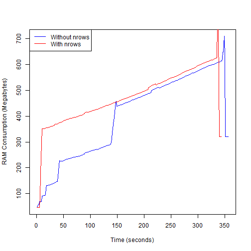

Test - read.csv(). Faster and more efficient with nrows?
========================================================
As everybody knows when dealing with large files is important to know the actual number of lines or rows in a data set for preallocating purposes so memory handle in R can be improved.  

But as usually happens whith those things everybody knows, they are not always true.  

Here I show the results of my own tests which doesn't seem to support that claim.

Counting the number of lines in a file can be handled from outside R by using the **shell()** function of the **base** package or by using R functions directly.   

Usual file formats do not represent a problem for using the **shell** technique; however many times we need to deal with messy files and/or with compressed files for which the count of lines can be innacurate.

In any case let's see how different approaches perform with compressed and uncompressed files.

First prepare our environment:

```r
rm(list = ls())
gc()
```

```
##          used (Mb) gc trigger (Mb) max used (Mb)
## Ncells 241620 13.0     407500 21.8   350000 18.7
## Vcells 447717  3.5     905753  7.0   859060  6.6
```

```r
my.path <- "C:/Users/Diego/Documents/Reproducible Research/PA2"
setwd(my.path)
fileZip <- "./StormData.csv.bz2"
fileUnz <- "./StormData.csv"
```

### Extract the zipped file

```r
library(R.utils)
```

```
## Loading required package: R.oo
## Loading required package: R.methodsS3
## R.methodsS3 v1.6.1 (2014-01-04) successfully loaded. See ?R.methodsS3 for help.
## R.oo v1.18.0 (2014-02-22) successfully loaded. See ?R.oo for help.
## 
## Attaching package: 'R.oo'
## 
## The following objects are masked from 'package:methods':
## 
##     getClasses, getMethods
## 
## The following objects are masked from 'package:base':
## 
##     attach, detach, gc, load, save
## 
## R.utils v1.29.8 (2014-01-27) successfully loaded. See ?R.utils for help.
## 
## Attaching package: 'R.utils'
## 
## The following object is masked from 'package:utils':
## 
##     timestamp
## 
## The following objects are masked from 'package:base':
## 
##     cat, commandArgs, getOption, inherits, isOpen, parse, warnings
```

```r
if (file.exists(fileUnz) == F) {
    system.time(bunzip2(fileZip))
}
```


Using R functions
--------------------------------------------------------
#### Zipped countLines using a connection

```r
con <- file(fileZip, "rb")
system.time(nrec01 <- countLines(con))
```

```
##    user  system elapsed 
##    5.80    1.45    7.46
```

```r
close(con)
nrec01
```

```
## [1] 400312
```

#### Zipped countLines using directly the file

```r
system.time(nrec01 <- countLines(fileZip))
```

```
##    user  system elapsed 
##    5.87    1.03    7.03
```

```r
nrec01
```

```
## [1] 400312
```


#### Unzipped countLines

```r
system.time(nrec02 <- countLines(fileUnz))
```

```
##    user  system elapsed 
##   65.50   11.25   87.61
```

```r
nrec02
```

```
## [1] 1415169
```


### Zipped scan

```r
system.time(nrec03 <- length(scan(file = fileZip, what = list(""), n = -1, sep = "\n")[[1]]))
```

```
##    user  system elapsed 
##  322.16    1.59  331.05
```

```r
nrec03
```

```
## [1] 1267891
```


### Unzipped scan

```r
system.time(nrec04 <- length(scan(file = fileUnz, what = list(""), n = -1, sep = "\n")[[1]]))
```

```
##    user  system elapsed 
##  132.17    1.17  135.56
```

```r
nrec04
```

```
## [1] 1267891
```


### fread

```r
library(data.table)
a <- fread(fileUnz)
```

```
## Error: Expected sep (',') but '
' ends field 36 on line 4 when detecting
## types: 20.00,8/25/2006 0:00:00,"07:05:00
## PM","CST",143.00,"OTTAWA","KS","HAIL",1.00,"S","MINNEAPOLIS",8/25/2006
## 0:00:00,"07:05:00
## PM",0.00,,1.00,"S","MINNEAPOLIS",0.00,0.00,,88.00,0.00,0.00,0.00,,0.00,,"TOP","KANSAS,
## East",,3907.00,9743.00,3907.00,9743.00,"Dime to nickel sized hail.
```


```
## Warning: object 'a' not found
```

### Zipped hsTableReader

```r
nrec05 <- 0
nlines <- function(d) {
    nrec05 <<- nrec05 + nrow(d)
}
library(HadoopStreaming)
```

```
## Loading required package: getopt
```

```r
con <- bzfile(fileZip, "rb")
system.time(d <- hsTableReader(con, FUN = nlines))
```

```
## Error: subscript out of bounds
```

```
## Timing stopped at: 316.9 1.17 324.2
```

```r
close(con)
nrec05
```

```
## [1] 902298
```


### Unzipped hsTableReader

```r
nrec06 <- 0
nlines <- function(d) {
    nrec06 <<- nrec06 + nrow(d)
}
con <- file(fileUnz, open = "r")
system.time(d <- hsTableReader(con, FUN = nlines))
```

```
## Error: subscript out of bounds
```

```
## Timing stopped at: 131 1.25 136
```

```r
close(con)
nrec06
```

```
## [1] 902298
```


### Zipped hsLineReader

```r
nrec07 <- 0
nlines <- function(d) {
    nrec07 <<- nrec07 + length(d)
}
con <- bzfile(fileZip, "rb")
system.time(d <- hsLineReader(con, FUN = nlines))
```

```
##    user  system elapsed 
##  292.47    1.23  302.77
```

```r
close(con)
nrec07
```

```
## [1] 1422162
```


### Unzipped hsLineReader

```r
nrec08 <- 0
nlines <- function(d) {
    nrec08 <<- nrec08 + length(d)
}
library(HadoopStreaming)
con <- file(fileUnz, open = "r")
system.time(d <- hsLineReader(con, FUN = nlines))
```

```
##    user  system elapsed 
##  110.62    1.53  116.10
```

```r
close(con)
nrec08
```

```
## [1] 1408176
```


Using the Shell (Windows)
--------------------------------------------------------
### Unzipped find /c

```r
system.time(nrec09 <- as.numeric(shell("type \"StormData.csv\" | find /c \",\"", 
    intern = T)))
```

```
##    user  system elapsed 
##    0.00    0.03   59.23
```

```r
nrec09
```

```
## [1] 1060906
```


### Unzipped find /v /c

```r
system.time(nrec10 <- as.numeric(shell("type \"StormData.csv\" | find /v /c \"\"", 
    intern = T)))
```

```
##    user  system elapsed 
##    0.01    0.00   55.29
```

```r
nrec10
```

```
## [1] 1232705
```


### Zipped find /c

```r
system.time(nrec11 <- as.numeric(shell("type \"StormData.csv.bz2\" | find /c \",\"", 
    intern = T)))
```

```
##    user  system elapsed 
##    0.00    0.00   10.51
```

```r
nrec11
```

```
## [1] 126715
```


### Zipped find /v /c

```r
system.time(nrec12 <- as.numeric(shell("type \"StormData.csv.bz2\" | find /v /c \"\"", 
    intern = T)))
```

```
##    user  system elapsed 
##    0.00    0.01    4.96
```

```r
nrec12
```

```
## [1] 533062
```


First we notice is the variety of results returned by each approach.   

Importantly only the **hsTableReader()** approach returned the correct results for this messy data set, even when an *out of bounds* error jumps.   

Among other things this is due to the use of a .csv file for storing complex things.

Interestingly, is faster to attack directly the file than using a connection.   

Noticeably, is faster to use zipped files than unzipped files with some methods but not with others.

Finally, is evident that the **shell** approach is way more efficient than any of the tested internal R functions.

Unfortunately, fred crashes with this complex csv file.

Among all, the fastest approach was **Zipped find /v /c**, but the results are not right.

However, that result is very close to the half of the **Unzipped find /c** approach which is the one reported by Phil Spector in his book *"Data Manipulation with R"* which is my gold standard to call it some way.

I'm not sure if the naive multiplication by 2 can be generalizable to all cases, but since it is very fast one can test it whenever needed.

Comparison
--------------------------------------------------------
### Get the classes

```r
storm.data <- read.csv(fileZip, stringsAsFactors = F, nrows = 10)
classes <- sapply(storm.data, class)
```


**read.csv()** loves conversions, and in this case getting the classes of the first rows doesn't help for passing the actual classes the colClasses argument as you can see below.

```r
Sys.time()
```

```
## [1] "2014-05-30 04:24:05 COT"
```

```r
system.time(storm.data <- read.csv(fileZip, header = TRUE, stringsAsFactors = F, 
    comment.char = "", colClasses = classes))
```

```
## Error: scan() expected 'an integer', got '"0130"'
```

```
## Timing stopped at: 0 0.02 0.02
```

```r
Sys.time()
```

```
## [1] "2014-05-30 04:24:05 COT"
```


### Without nrows

```r
Sys.time()
```

```
## [1] "2014-05-30 04:24:05 COT"
```

```r
system.time(storm.data <- read.csv(fileZip, header = TRUE, stringsAsFactors = F, 
    comment.char = "", colClasses = "character"))
```

```
##    user  system elapsed 
##  368.76    1.82  382.04
```

```r
Sys.time()
```

```
## [1] "2014-05-30 04:30:27 COT"
```


### With nrows

```r
Sys.time()
```

```
## [1] "2014-05-30 04:30:28 COT"
```

```r
system.time(nrec12 <- as.numeric(shell("type \"StormData.csv.bz2\" | find /v /c \"\"", 
    intern = T)))
```

```
##    user  system elapsed 
##    0.00    0.00    9.54
```

```r
nrec12 <- nrec12 * 2
system.time(storm.data <- read.csv(fileZip, stringsAsFactors = F, comment.char = "", 
    colClasses = "character", nrows = nrec12))
```

```
##    user  system elapsed 
##  348.62    1.41  356.00
```

```r
Sys.time()
```

```
## [1] "2014-05-30 04:36:34 COT"
```


While there's a little improvement in time is not that dramatic as I expected considering what others have reported.  

I mean, 12 seconds are valuable, but I spent ~2 days doing the tests.

I created an external application for tracking the memory usage by R during this process, and here are the results:

```r
file1 <- "./Table1.txt"
file2 <- "./Table3.txt"

x <- read.csv(file1, stringsAsFactors = F, comment.char = "", colClasses = c("integer", 
    "character", "integer"))
y <- read.csv(file2, stringsAsFactors = F, comment.char = "", colClasses = c("integer", 
    "character", "integer"))

x$RAM <- as.integer(round(x$RAM * 0.000976562), 0)
y$RAM <- as.integer(round(y$RAM * 0.000976562), 0)

plot(x$ID, x$RAM, type = "l", col = "blue", xlab = "Time (seconds)", ylab = "RAM Consumption (Megabytes)")
lines(y$RAM, type = "l", col = "red")
legend("topleft", legend = c("Without nrows", "With nrows"), col = c("blue", 
    "red"), lty = 1, lwd = 1.5)
```

 


Evidently, passing a number to the **nrows** argument allows **read.csv()** to preallocate the data frame for receiving the csv file.  

However, the RAM consumptions is even superior by preallocating!  

I'll need to do further tests with other data sets in oder to get a final conclusion, but at least in this case passing an argument to nrows doesn't seem to improve significatively the efficiency of the **read.csv()** function.

 ---
Note: For the test I had to close and re-start R, since as you can notice, even after calling the garbage collector the memory is not totally recovered.  
 ---

